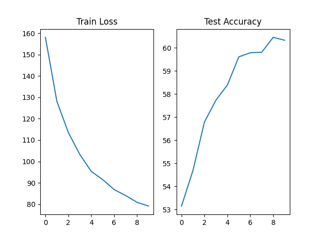
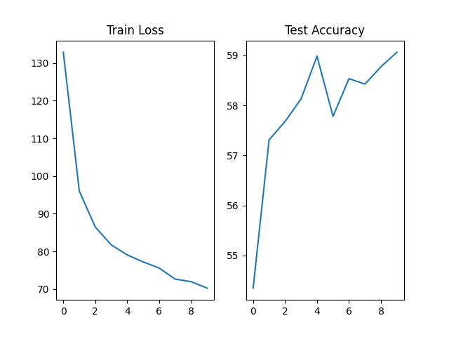

# Environment
- Python 3.8.5
- PyTorch 1.7.0

# Task Overview
<p align="center">
  
</p>

In this task, weights of the binary classification are obtained from meta-model which is specified as 2 layer Multilayer Perceptron. Since task is a linear classification, therefore, weights are directly multiplied with images vector in the query. Query examples contain both positive examples and negative examples. For example, from the figure, we can see that digit of 7 was selected as target class and meta model takes one image example of this class. Meta model produces weight matrix according to sample image. By multiplying weight matrix and vector of images in the query, probability of query images are belong to target class are computed.

# Dataset Preparation
For this task MNIST dataset was used. Dataset class was implemented so that Dataloader returns query images, query labels, target sample that meta model takes. Custom transform function was implemented for train and test dataset seperately. For train dataset, function normalize, rotate and flip the images because it is observe that data augmentation increases the model performance. For test dataset, only normalization operation was applied. In Dataloader, __get_item__() is implemented so that it chooses the indexed image as target image. Queries were shaped according to class of the target image. For example, if __get_item__() method returns digit of 3, then one query which consists of four images of digit 3 and four images of other digits was attached to this target image.
<p align="center">
  
</p>
<p align="center">
  Figure: Query example for digit 6 (Labels of the query were written in title)
</p>


# Model Selection
Two diffrent meta model architecture were used. In Multilayer Perceptron module, 2 hidden layer whose number of neuron is **128** were used. It is observed that 64 neurons unable to capture relationship between model and data while 256 neurons lead to overfitting. Value of 128 enable model to generalize well and it prevents overfitting problem. Also, **dropout** is used to prevent overfitting problem. Without activation function, it is not possible to train model for nonlinear optimization. Activation functions of the hidden layer were selected **ReLU** because it is fast, and empirically it seems to work well. For the last layer, **tanh** function is used because it normalizes the weights so that classification can be less biased.
In CNN module, simple CNN architecture which is inspired from the blog(https://medium.com/@nutanbhogendrasharma/pytorch-convolutional-neural-network-with-mnist-dataset-4e8a4265e118). It is also observed that **batch normalization** increases the model performance. 

# Hyperparameter Tuning
All hyperparameters were selected so that model can generalize and learn patterns of the digits properly. Since learning rate is the critical parameter, Optuna tool which enable user to get optimum hyperparameter value was used. Different learning rate values were obtained for both mlp and cnn modules. Code of the hyperparameter search is in the **optuna** branch. Following result was taken in optuna and learning rate for MLP module is determined as **1e-4**:
<p align="center">
  
</p>
<p align="center">
  Figure: Best experiment results in Optuna
</p>
<p align="center">
  
</p>
<p align="center">
  Figure: Accurcy plot of the best result
</p>

# Training and Test Procedure
In the task it is stated that "you should first sample a training class and then sample a single training example from that class. Then sample a bunch of so-called query examples from the training set.". Queries and sample from target class are obtained by dataloader of the custom dataset class. Since it is not clear in task whether only one target class will be used at each epoch, two different strategy were tested seperately. It is observed that using different target class and queries increases the performance. Backward procedure was done similar to **Episodic Learning**. Therefore, training procedure is similar to test procedure.

# Results
Training loss and test accuracy values are recorded through training. At the end of the training, recorded values are visualize by using matplotlib library. Results were obtained for both MLP and CNN based models. It is observed that MLP module gave more accurate result but ther performance can be interpreted as similar at this complexitly level. If model complexity increases, CNN starts to give better results because it can learn representation of the digits much more efficiently.

<p align="center">
  
</p>
<p align="center">
  Figure: Training Loss and Test Accuracy Results for MLP model
</p>
<p align="center">
  
</p>
<p align="center">
  Figure: Training Loss and Test Accuracy Results for CNN model
</p>

# Running
To train model, run the command below.
```
python3 main.py --num-iter [N] --train-iter [TRI]\
--test-iter [TSI] --hidden-dim [H] --image-size [S]\
--query-size [Q] --module-type [M] --batch-size [B]\
--lr [L] --output[O] --device [D]
```

**Parameter Name**|**Type**|**Default Value**|**Description**
:-----:|:-----:|:-----:|:-----:
[**N**]|int|10|Number of epoch
[**TRI**]|int|200|Number of train iterations
[**TSI**]|int|100|Number of test iterations
[**H**]|int|128|Number of neurons in hidden layer
[**S**]|int|28|Width and Height
[**D**]|int|0|GPU
[**Q**]|int|8|Query size
[**M**]|str|'mlp'|Module Type: 'mlp' or 'cnn'
[**B**]|int|32|Batch size of queries
[**L**]|float|3e-04|Learning Rate
[**O**]|str|"output/"|outputs path

It is recommended that 
```
python3 main.py --num-iter 10 --train-iter 200 --test-iter 100 --hidden-dim 128 --image-size 28 --query-size 8 --module-type 'mlp' --batch-size 32 --lr 1e-4 --device 0
```


